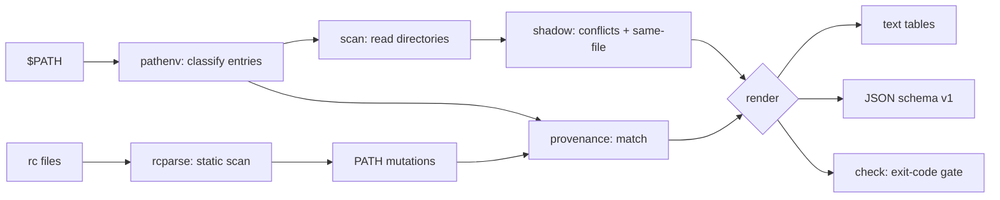

# pathdoc

[English](README.md) | [中文](README.zh.md) | [日本語](README.ja.md)

[](LICENSE) [](go.mod) [](CHANGELOG.md)  [](CONTRIBUTING.md)

**pathdoc：オープンソース・依存ゼロの $PATH 診断 CLI —— 重複、消滅ディレクトリ、シャドウされたバイナリ、どのエントリが勝つか —— さらに出所つき：各エントリを追加した rc の行まで特定します。**


```bash
git clone https://github.com/JaydenCJ/pathdoc && cd pathdoc
go build -o pathdoc ./cmd/pathdoc    # single static binary, stdlib only
```

> プレリリース：v0.1.0 はまだパッケージレジストリに公開していません。上記の通りソースからビルドしてください（Go ≥1.22、Linux/macOS）。

## なぜ pathdoc？

「動いている python が違う」—— pyenv・nvm・homebrew・conda・dotfiles を重ねて使う人にとって、これは毎週何時間も奪う実害ですが、定番ツールは問いの半分しか答えません。`which -a` や `type -a` は候補を並べるだけで、勝者が*なぜ*勝つのか、敗者が実は同じファイル（usr-merge やシンボリックリンク群）なのか、5 つある rc ファイルのどれが問題のディレクトリを先頭に差し込んだのかは教えてくれません。`$PATH` を `tr` で分解してもエントリは見えても健康状態は見えません：毎回の検索を遅くする重複、とうに消えたディレクトリ、こっそり「カレントディレクトリ」を意味する空セグメント、誰でも偽の `ls` を置ける全員書き込み可のディレクトリ。pathdoc は診断を一度で済ませます：各エントリを分類し、実際のディレクトリ内容を走査してシャドウされたコマンドをすべて発見し、無害な同一ファイルのシャドウと本物のバージョン衝突を区別し —— さらにシェルの起動ファイル（POSIX 代入、zsh の `path` 配列、fish、`/etc/paths`、`source` チェーン、14 種のバージョンマネージャの eval フック）を静的に走査して、各エントリを追加したファイルと行番号を表示します。分からないところは分からないと言います：未解決の変数は決してマッチせず、解析不能な行は opaque と報告し、継承されたエントリは親プロセス由来と明記します。

| | pathdoc | which -a | type -a | echo $PATH \| tr ':' '\n' |
|---|---|---|---|---|
| PATH 順にすべての候補を表示 | ✅ | ✅ | ✅ | ❌ ディレクトリのみ |
| 重複 / 消滅 / 空セグメント診断 | ✅ | ❌ | ❌ | 目視頼み |
| 同一ファイル検出（シンボリック・ハードリンク対応） | ✅ | ❌ | ❌ | ❌ |
| どの rc 行が各エントリを追加したか | ✅ | ❌ | ❌ | ❌ |
| バージョンマネージャのフック（pyenv、nvm、brew…） | ✅ | ❌ | ❌ | ❌ |
| セキュリティ検査（空セグメント、全員書き込み可） | ✅ | ❌ | ❌ | ❌ |
| 安定 JSON + 終了コードゲート | ✅ | ❌ | ❌ | ❌ |
| 実行時依存 | 0 | 0（内蔵） | 0（内蔵） | 0（内蔵） |

<sub>比較は 2026-07-12 時点の GNU which 2.21 と bash/zsh ビルトインで確認。pathdoc は Go 標準ライブラリのみを使用。</sub>

## 機能

- **PATH 全体の診断** —— 各エントリを順に分類：テキストレベルとシンボリックリンクレベルの重複、消滅ディレクトリ、ディレクトリのふりをしたファイル、空セグメント（= カレントディレクトリ）、相対パス、展開されない `~`、全員書き込み可・読み取り不能ディレクトリ —— それぞれに重大度と平易な説明つき。
- **判定つきシャドウ分析** —— ディレクトリの実内容を走査し、複数の提供元を持つコマンドを列挙、勝者に印をつけ、各敗者に `same file as winner`（無害）か `different file`（例の「違う python」）のラベルを付けます。
- **推測ではなく出所** —— シェルが読む順に起動ファイルを静的走査し、`source` チェーンを辿り、エントリの横に `~/.zshrc:12` を表示。未知の変数やコマンド置換は推測せず unresolved/opaque として報告します。
- **バージョンマネージャに精通** —— pyenv、rbenv、nodenv、goenv、jenv、nvm、rustup、homebrew、sdkman、conda、asdf、mise、volta、fnm の eval フックを認識し、`~/.nvm/versions/node/*/bin` のようなバージョン付きディレクトリの glob パターンにも対応。
- **直せる、締められる** —— `pathdoc dedupe` は掃除済み PATH を出力（plain、`export`、fish 形式）；`pathdoc check --fail-on warn|error` は診断を終了コードに変え、dotfiles の衛生を守ります。
- **スクリプトから使える** —— `report`・`which`・`shadows`・`rc` に安定 JSON（`schema_version: 1`）；終了コードはすべて文書化。
- **依存ゼロ・完全オフライン** —— Go 標準ライブラリのみ。ファイルシステムを読むだけで、何も書かず、何も送信しません。`--path`/`--home`/`--rc` の上書きで、現在の PATH 以外も診断できます。

## クイックスタート

```bash
# fabricate a tangled demo environment (or just run `pathdoc report` on your own)
bash examples/make-demo-env.sh /tmp/pathdoc-demo
pathdoc report --path "…demo PATH…" --home /tmp/pathdoc-demo/home --rc /tmp/pathdoc-demo/home/.zshrc
```

実際にキャプチャした出力：

```text
pathdoc report — 6 entries · 3 clean · 3 issue(s) · 2 shadowing conflict(s) (1 benign)
provenance: 1 rc file(s) scanned · 2 PATH-modifying line(s)

 #  entry                        status               provenance
 1  ~/.pyenv/shims               ok                   ~/.zshrc:1 · pyenv hook
 2  /tmp/pathdoc-demo/local/bin  ok                   ~/.zshrc:2
 3  /tmp/pathdoc-demo/sys/bin    ok                   (inherited — no rc line found)
 4  /tmp/pathdoc-demo/local/bin  duplicate of #2      ~/.zshrc:2
 5  /tmp/pathdoc-demo/old/bin    does not exist       (inherited — no rc line found)
 6  (empty)                      empty = current dir  —

issues
  [warn ] entry 4 (/tmp/pathdoc-demo/local/bin) duplicates entry 2 and is never consulted
  [warn ] entry 5 (/tmp/pathdoc-demo/old/bin) does not exist
  [error] entry 6 is empty — the shell treats an empty segment as the current directory, so any file in $PWD named like a command wins

shadowing
  node     /tmp/pathdoc-demo/local/bin/node wins · 1 shadowed · same file — benign
  python3  ~/.pyenv/shims/python3 wins · 2 shadowed · 2 different file(s)

run `pathdoc which <command>` to see every candidate with provenance.
```

*どの python3 が実行され、誰が置いたのか*を尋ねる（`pathdoc which python3`、実出力）：

```text
python3 — 3 candidate(s) on PATH, first wins

  ► ~/.pyenv/shims/python3    (wins)
      entry 1 · added by ~/.zshrc:1 · pyenv hook
    /tmp/pathdoc-demo/local/bin/python3    (shadowed — different file)
      entry 2 · added by ~/.zshrc:2
    /tmp/pathdoc-demo/sys/bin/python3    (shadowed — different file)
      entry 3 · no rc line claims this entry (inherited)
```

dotfiles にゲートを設ける（`pathdoc check`、所見があれば終了コード 1）：

```text
pathdoc check — fail on warn and above

  [warn ] entry 4 (/tmp/pathdoc-demo/local/bin) duplicates entry 2 and is never consulted
  [warn ] entry 5 (/tmp/pathdoc-demo/old/bin) does not exist
  [error] entry 6 is empty — the shell treats an empty segment as the current directory, so any file in $PWD named like a command wins
  [info ] node has 2 providers, all the same file (benign)
  [warn ] python3 is shadowed: ~/.pyenv/shims/python3 hides 2 other candidate(s), 2 different file(s)

check: FAIL (4 finding(s) at or above warn)
```

## サブコマンドとフラグ

`pathdoc [report|which|shadows|rc|dedupe|check|version]` —— 既定は `report`。終了コード：0 正常、1 所見あり / 未発見、2 用法エラー、3 実行時エラー。フラグは位置引数より前に書きます。

| フラグ | 既定値 | 効果 |
|---|---|---|
| `--path` | `$PATH` | 現在の値ではなく指定した PATH を診断する |
| `--home` | `$HOME` | `~` の展開と表示に使う home ディレクトリ |
| `--shell` | `$SHELL` から | どのシェルの起動ファイルを走査するか：`bash`、`zsh`、`fish`、`sh` |
| `--rc` | シェル既定 | 走査する rc ファイル（繰り返し可・順序どおり；既定セットを置換） |
| `--no-provenance` | オフ | rc 走査を完全にスキップ |
| `--format` | `text` | `text` か `json`（`report`、`which`、`shadows`、`rc`） |
| `--all`（shadows） | オフ | 無害な同一ファイル衝突も表示する |
| `--drop-dead` / `--drop-unsafe`（dedupe） | オフ | 消滅 / 危険なエントリも削除する |
| `--emit`（dedupe） | `plain` | 出力形式：`plain`、`export`、`fish` |
| `--fail-on`（check） | `warn` | 失敗しきい値：`warn` か `error` |

## 診断項目

| 所見 | 重大度 | 意味 |
|---|---|---|
| `empty`、`relative`、`tilde`、`world-writable` | error | *どのバイナリが動くか*を変え得る（あるいは他ユーザーに決めさせる） |
| `dead`、`not-dir`、`duplicate`、`symlink-duplicate`、`unreadable` | warn | ゴミ：無駄な検索、決して参照されないエントリ |
| 異なるファイルのシャドウ衝突 | warn | 別のファイルが先行エントリに隠されている |
| 無害なシャドウ（同一ファイル） | info | シンボリックリンク群、usr-merge —— 既定では非表示 |

rc 走査の仕組み —— 対応構文、14 種のフックパターン、マッチ規則、正直な制限事項 —— は [docs/rc-provenance.md](docs/rc-provenance.md) に明記しています。

## 検証

このリポジトリは CI を同梱しません。上記の主張はすべてローカル実行で検証されています：

```bash
go test ./...            # 91 deterministic tests, offline, < 5 s
bash scripts/smoke.sh    # end-to-end CLI check, prints SMOKE OK
```

## アーキテクチャ



## ロードマップ

- [x] v0.1.0 —— エントリ分類、同一ファイル判定つきシャドウ分析、rc 出所（POSIX/zsh/fish/フック/source チェーン）、which/shadows/rc/dedupe/check、JSON 出力、91 テスト + smoke スクリプト
- [ ] `pathdoc fix --apply` —— 問題の rc 行をバックアップつきで書き換え
- [ ] csh/tcsh（`setenv PATH`）と PowerShell プロファイル対応
- [ ] ログインシェルと対話シェルの差分モード（なぜ tmux の PATH は違うのか）
- [ ] 関数本体の帰属（source された関数の呼び出し元まで出所を辿る）
- [ ] シェル補完と `--color` モード

全リストは [open issues](https://github.com/JaydenCJ/pathdoc/issues) を参照してください。

## コントリビュート

issue・議論・プルリクエストを歓迎します —— ローカルの作業手順（フォーマット、vet、テスト、`SMOKE OK`）は [CONTRIBUTING.md](CONTRIBUTING.md) を参照。入門タスクは [good first issue](https://github.com/JaydenCJ/pathdoc/issues?q=is%3Aissue+is%3Aopen+label%3A%22good+first+issue%22)、設計の議論は [Discussions](https://github.com/JaydenCJ/pathdoc/discussions) へ。

## ライセンス

[MIT](LICENSE)
