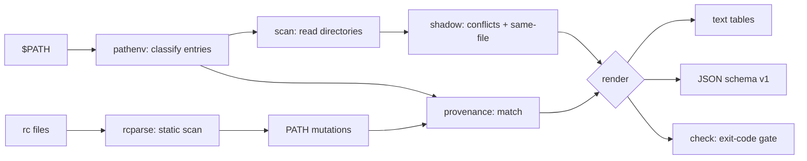

# pathdoc

[English](README.md) | [中文](README.zh.md) | [日本語](README.ja.md)

[](LICENSE) [](go.mod) [](CHANGELOG.md)  [](CONTRIBUTING.md)

**pathdoc：an open-source, zero-dependency CLI that diagnoses $PATH — duplicates, dead directories, shadowed binaries, which entry wins — with provenance: the exact rc line that added each entry.**


```bash
git clone https://github.com/JaydenCJ/pathdoc && cd pathdoc
go build -o pathdoc ./cmd/pathdoc    # single static binary, stdlib only
```

> Pre-release: v0.1.0 is not tagged on a package registry yet; build from source as above (any Go ≥1.22, Linux/macOS).

## Why pathdoc?

"The wrong python is running" costs real hours for anyone stacking pyenv, nvm, homebrew, conda, and a dotfiles repo — and the classic tools only answer half the question. `which -a` and `type -a` list the candidates but say nothing about *why* the winner wins, whether the losers are actually the same file (usr-merge, symlink farms), or which of your five rc files planted the offending directory in front. Piping `$PATH` through `tr` shows you the entries but none of their health: duplicates that slow every lookup, directories that no longer exist, the empty segment that quietly means "current directory", the world-writable dir anyone can drop a fake `ls` into. pathdoc does the whole diagnosis in one pass: it classifies every entry, scans the real directory contents to find every shadowed command, distinguishes benign same-file shadowing from genuine version conflicts — and then statically scans your shell's startup files (POSIX assignments, zsh `path` arrays, fish, `/etc/paths`, `source` chains, and the eval hooks of 14 version managers) to print the file and line that added each entry. Where it cannot know, it says so: unresolved variables never match, unparseable lines are reported as opaque, and inherited entries are labelled as coming from the parent process.

| | pathdoc | which -a | type -a | echo $PATH \| tr ':' '\n' |
|---|---|---|---|---|
| Every candidate in PATH order | ✅ | ✅ | ✅ | ❌ dirs only |
| Duplicate / dead / empty-entry diagnosis | ✅ | ❌ | ❌ | by eye |
| Same-file detection (symlink & hardlink aware) | ✅ | ❌ | ❌ | ❌ |
| Which rc line added each entry | ✅ | ❌ | ❌ | ❌ |
| Version-manager hooks (pyenv, nvm, brew, …) | ✅ | ❌ | ❌ | ❌ |
| Security checks (empty segment, world-writable) | ✅ | ❌ | ❌ | ❌ |
| Stable JSON + exit-code gate | ✅ | ❌ | ❌ | ❌ |
| Runtime dependencies | 0 | 0 (built-in) | 0 (built-in) | 0 (built-in) |

<sub>Comparison checked 2026-07-12 against GNU which 2.21 and the bash/zsh builtins; pathdoc imports the Go standard library only.</sub>

## Features

- **Full-PATH diagnosis** — every entry classified in order: textual and symlink-level duplicates, dead directories, files posing as directories, empty segments (= current directory), relative entries, unexpanded `~`, world-writable and unreadable dirs — each with a severity and a plain-English explanation.
- **Shadowing with verdicts** — scans the actual directory contents, lists every command with multiple providers, marks the winner, and labels each loser `same file as winner` (benign) or `different file` (your "wrong python").
- **Provenance, not guesses** — statically scans your shell's startup files in the order the shell reads them, follows `source` chains, and prints `~/.zshrc:12` next to the entry that line added; unknown variables and command substitutions are reported as unresolved/opaque instead of being guessed at.
- **Version-manager literate** — recognizes the eval hooks of pyenv, rbenv, nodenv, goenv, jenv, nvm, rustup, homebrew, sdkman, conda, asdf, mise, volta, and fnm, including glob patterns for versioned dirs like `~/.nvm/versions/node/*/bin`.
- **Fix it, gate it** — `pathdoc dedupe` emits a cleaned PATH (plain, `export`, or fish form); `pathdoc check --fail-on warn|error` turns the diagnosis into an exit code for dotfiles hygiene.
- **Scriptable** — stable JSON (`schema_version: 1`) for `report`, `which`, `shadows`, and `rc`; documented exit codes throughout.
- **Zero dependencies, fully offline** — Go standard library only; reads the filesystem, writes nothing, sends nothing. `--path`/`--home`/`--rc` overrides let it diagnose any PATH, not just the live one.

## Quickstart

```bash
# fabricate a tangled demo environment (or just run `pathdoc report` on your own)
bash examples/make-demo-env.sh /tmp/pathdoc-demo
pathdoc report --path "…demo PATH…" --home /tmp/pathdoc-demo/home --rc /tmp/pathdoc-demo/home/.zshrc
```

Real captured output:

```text
pathdoc report — 6 entries · 3 clean · 3 issue(s) · 2 shadowing conflict(s) (1 benign)
provenance: 1 rc file(s) scanned · 2 PATH-modifying line(s)

 #  entry                        status               provenance
 1  ~/.pyenv/shims               ok                   ~/.zshrc:1 · pyenv hook
 2  /tmp/pathdoc-demo/local/bin  ok                   ~/.zshrc:2
 3  /tmp/pathdoc-demo/sys/bin    ok                   (inherited — no rc line found)
 4  /tmp/pathdoc-demo/local/bin  duplicate of #2      ~/.zshrc:2
 5  /tmp/pathdoc-demo/old/bin    does not exist       (inherited — no rc line found)
 6  (empty)                      empty = current dir  —

issues
  [warn ] entry 4 (/tmp/pathdoc-demo/local/bin) duplicates entry 2 and is never consulted
  [warn ] entry 5 (/tmp/pathdoc-demo/old/bin) does not exist
  [error] entry 6 is empty — the shell treats an empty segment as the current directory, so any file in $PWD named like a command wins

shadowing
  node     /tmp/pathdoc-demo/local/bin/node wins · 1 shadowed · same file — benign
  python3  ~/.pyenv/shims/python3 wins · 2 shadowed · 2 different file(s)

run `pathdoc which <command>` to see every candidate with provenance.
```

Ask *which python3 would run, and who put it there* (`pathdoc which python3`, real output):

```text
python3 — 3 candidate(s) on PATH, first wins

  ► ~/.pyenv/shims/python3    (wins)
      entry 1 · added by ~/.zshrc:1 · pyenv hook
    /tmp/pathdoc-demo/local/bin/python3    (shadowed — different file)
      entry 2 · added by ~/.zshrc:2
    /tmp/pathdoc-demo/sys/bin/python3    (shadowed — different file)
      entry 3 · no rc line claims this entry (inherited)
```

Gate your dotfiles (`pathdoc check`, exit code 1 on findings):

```text
pathdoc check — fail on warn and above

  [warn ] entry 4 (/tmp/pathdoc-demo/local/bin) duplicates entry 2 and is never consulted
  [warn ] entry 5 (/tmp/pathdoc-demo/old/bin) does not exist
  [error] entry 6 is empty — the shell treats an empty segment as the current directory, so any file in $PWD named like a command wins
  [info ] node has 2 providers, all the same file (benign)
  [warn ] python3 is shadowed: ~/.pyenv/shims/python3 hides 2 other candidate(s), 2 different file(s)

check: FAIL (4 finding(s) at or above warn)
```

## Subcommands & flags

`pathdoc [report|which|shadows|rc|dedupe|check|version]` — `report` is the default. Exit codes: 0 ok, 1 findings / not found, 2 usage error, 3 runtime error. Flags go before positional names.

| Flag | Default | Effect |
|---|---|---|
| `--path` | `$PATH` | diagnose this PATH value instead of the live one |
| `--home` | `$HOME` | home directory for `~` expansion and display |
| `--shell` | from `$SHELL` | whose startup files to scan: `bash`, `zsh`, `fish`, `sh` |
| `--rc` | shell defaults | rc file to scan (repeatable, in order; replaces the default set) |
| `--no-provenance` | off | skip rc scanning entirely |
| `--format` | `text` | `text` or `json` (`report`, `which`, `shadows`, `rc`) |
| `--all` (shadows) | off | include benign same-file conflicts |
| `--drop-dead` / `--drop-unsafe` (dedupe) | off | also remove dead / hazardous entries |
| `--emit` (dedupe) | `plain` | `plain`, `export`, or `fish` output form |
| `--fail-on` (check) | `warn` | fail threshold: `warn` or `error` |

## Diagnoses

| Finding | Severity | Meaning |
|---|---|---|
| `empty`, `relative`, `tilde`, `world-writable` | error | can change *which binary runs* (or lets another user decide) |
| `dead`, `not-dir`, `duplicate`, `symlink-duplicate`, `unreadable` | warn | cruft: wasted lookups, never-consulted entries |
| distinct shadowing conflict | warn | a different file is hidden by an earlier entry |
| benign shadowing (same file) | info | symlink farms, usr-merge — hidden by default |

How rc scanning works — supported syntax, the 14 hook patterns, matching rules, and honest limitations — is specified in [docs/rc-provenance.md](docs/rc-provenance.md).

## Verification

This repository ships no CI; every claim above is verified by local runs:

```bash
go test ./...            # 91 deterministic tests, offline, < 5 s
bash scripts/smoke.sh    # end-to-end CLI check, prints SMOKE OK
```

## Architecture



## Roadmap

- [x] v0.1.0 — entry classification, shadowing with same-file verdicts, rc provenance (POSIX/zsh/fish/hooks/source-chains), which/shadows/rc/dedupe/check, JSON output, 91 tests + smoke script
- [ ] `pathdoc fix --apply` — rewrite the offending rc lines in place, with backups
- [ ] csh/tcsh (`setenv PATH`) and PowerShell profile support
- [ ] Login-vs-interactive diff mode (why tmux sees a different PATH)
- [ ] Function-body attribution (call-site provenance for sourced functions)
- [ ] Shell completions and a `--color` mode

See the [open issues](https://github.com/JaydenCJ/pathdoc/issues) for the full list.

## Contributing

Issues, discussions and pull requests are welcome — see [CONTRIBUTING.md](CONTRIBUTING.md) for the local workflow (format, vet, tests, `SMOKE OK`). Good entry points are labelled [good first issue](https://github.com/JaydenCJ/pathdoc/issues?q=is%3Aissue+is%3Aopen+label%3A%22good+first+issue%22), and design questions live in [Discussions](https://github.com/JaydenCJ/pathdoc/discussions).

## License

[MIT](LICENSE)
