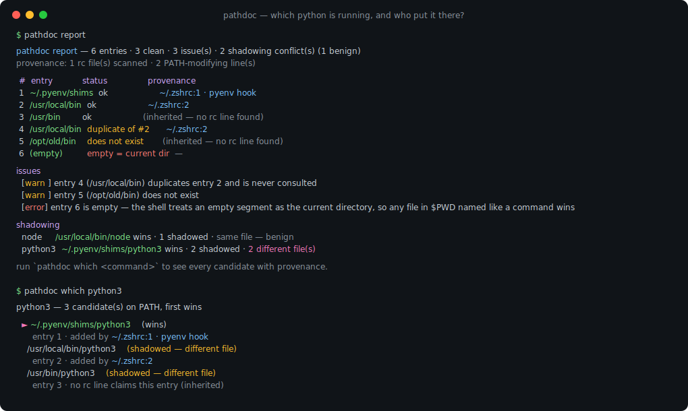
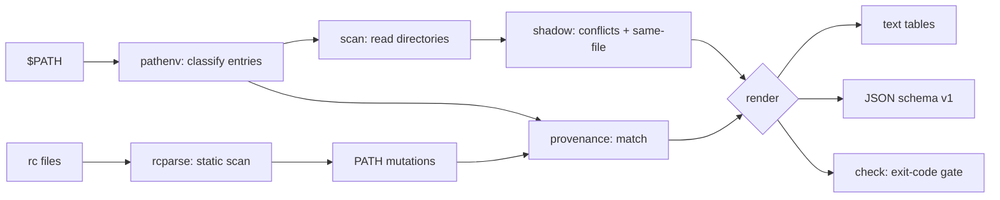

# pathdoc

[English](README.md) | [中文](README.zh.md) | [日本語](README.ja.md)

[](LICENSE) [](go.mod) [](CHANGELOG.md)  [](CONTRIBUTING.md)

**pathdoc：开源、零依赖的 $PATH 诊断 CLI —— 重复项、失效目录、被遮蔽的二进制、哪个条目获胜 —— 并带出处：精确到添加每个条目的那一行 rc 配置。**



```bash
git clone https://github.com/JaydenCJ/pathdoc && cd pathdoc
go build -o pathdoc ./cmd/pathdoc    # single static binary, stdlib only
```

> 预发布：v0.1.0 尚未在任何包仓库打 tag，请按上述方式从源码构建（Go ≥1.22，Linux/macOS）。

## 为什么选 pathdoc？

"跑起来的 python 不对"——对同时叠加 pyenv、nvm、homebrew、conda 和 dotfiles 仓库的人来说，这每周都在浪费真实的时间——而经典工具只回答了一半问题。`which -a` 和 `type -a` 能列出候选，却说不清赢家*为什么*赢、输家是否其实是同一个文件（usr-merge、符号链接群），也说不清你五个 rc 文件里到底是哪个把肇事目录插到了前面。用 `tr` 展开 `$PATH` 只能看到条目，看不到它们的健康度：拖慢每次查找的重复项、早已不存在的目录、悄悄等于"当前目录"的空段、任何人都能塞进假 `ls` 的全局可写目录。pathdoc 一次跑完整套诊断：给每个条目分类，扫描真实目录内容找出所有被遮蔽的命令，区分无害的同文件遮蔽与真正的版本冲突——然后静态扫描 shell 启动文件（POSIX 赋值、zsh `path` 数组、fish、`/etc/paths`、`source` 链，以及 14 种版本管理器的 eval 钩子），把添加每个条目的文件与行号直接打印出来。无法确定的地方它会明说：未解析的变量绝不参与匹配，解析不了的行标记为 opaque，继承来的条目会注明来自父进程。

| | pathdoc | which -a | type -a | echo $PATH \| tr ':' '\n' |
|---|---|---|---|---|
| 按 PATH 顺序列出所有候选 | ✅ | ✅ | ✅ | ❌ 仅目录 |
| 重复 / 失效 / 空段诊断 | ✅ | ❌ | ❌ | 靠肉眼 |
| 同文件检测（识别符号链接与硬链接） | ✅ | ❌ | ❌ | ❌ |
| 哪一行 rc 添加了每个条目 | ✅ | ❌ | ❌ | ❌ |
| 版本管理器钩子（pyenv、nvm、brew…） | ✅ | ❌ | ❌ | ❌ |
| 安全检查（空段、全局可写） | ✅ | ❌ | ❌ | ❌ |
| 稳定 JSON + 退出码门禁 | ✅ | ❌ | ❌ | ❌ |
| 运行时依赖 | 0 | 0（内建） | 0（内建） | 0（内建） |

<sub>对比基于 2026-07-12 的 GNU which 2.21 与 bash/zsh 内建命令核对；pathdoc 只引用 Go 标准库。</sub>

## 功能

- **全量 PATH 诊断** —— 按顺序给每个条目分类：文本级与符号链接级重复、失效目录、伪装成目录的文件、空段（= 当前目录）、相对路径条目、未展开的 `~`、全局可写与不可读目录——每项都有严重级别和一句大白话解释。
- **带裁定的遮蔽分析** —— 扫描目录的真实内容，列出所有多来源命令，标出赢家，并给每个输家打上 `same file as winner`（无害）或 `different file`（你的"错版 python"）标签。
- **给出处，不猜测** —— 按 shell 的读取顺序静态扫描启动文件，跟随 `source` 链，在条目旁直接打印 `~/.zshrc:12`；未知变量与命令替换会被标为 unresolved/opaque，而不是被瞎猜。
- **认得版本管理器** —— 识别 pyenv、rbenv、nodenv、goenv、jenv、nvm、rustup、homebrew、sdkman、conda、asdf、mise、volta、fnm 的 eval 钩子，包括 `~/.nvm/versions/node/*/bin` 这类带版本号目录的 glob 模式。
- **能修复，能门禁** —— `pathdoc dedupe` 输出清理后的 PATH（plain、`export` 或 fish 形式）；`pathdoc check --fail-on warn|error` 把诊断变成退出码，守护 dotfiles 卫生。
- **易于脚本化** —— `report`、`which`、`shadows`、`rc` 均有稳定 JSON（`schema_version: 1`）；全程退出码有文档。
- **零依赖、完全离线** —— 只用 Go 标准库；只读文件系统，不写任何东西，不发送任何东西。`--path`/`--home`/`--rc` 覆盖项让它能诊断任意 PATH，而不只是当前这个。

## 快速上手

```bash
# fabricate a tangled demo environment (or just run `pathdoc report` on your own)
bash examples/make-demo-env.sh /tmp/pathdoc-demo
pathdoc report --path "…demo PATH…" --home /tmp/pathdoc-demo/home --rc /tmp/pathdoc-demo/home/.zshrc
```

真实捕获的输出：

```text
pathdoc report — 6 entries · 3 clean · 3 issue(s) · 2 shadowing conflict(s) (1 benign)
provenance: 1 rc file(s) scanned · 2 PATH-modifying line(s)

 #  entry                        status               provenance
 1  ~/.pyenv/shims               ok                   ~/.zshrc:1 · pyenv hook
 2  /tmp/pathdoc-demo/local/bin  ok                   ~/.zshrc:2
 3  /tmp/pathdoc-demo/sys/bin    ok                   (inherited — no rc line found)
 4  /tmp/pathdoc-demo/local/bin  duplicate of #2      ~/.zshrc:2
 5  /tmp/pathdoc-demo/old/bin    does not exist       (inherited — no rc line found)
 6  (empty)                      empty = current dir  —

issues
  [warn ] entry 4 (/tmp/pathdoc-demo/local/bin) duplicates entry 2 and is never consulted
  [warn ] entry 5 (/tmp/pathdoc-demo/old/bin) does not exist
  [error] entry 6 is empty — the shell treats an empty segment as the current directory, so any file in $PWD named like a command wins

shadowing
  node     /tmp/pathdoc-demo/local/bin/node wins · 1 shadowed · same file — benign
  python3  ~/.pyenv/shims/python3 wins · 2 shadowed · 2 different file(s)

run `pathdoc which <command>` to see every candidate with provenance.
```

问一句*哪个 python3 会被执行，是谁放的*（`pathdoc which python3`，真实输出）：

```text
python3 — 3 candidate(s) on PATH, first wins

  ► ~/.pyenv/shims/python3    (wins)
      entry 1 · added by ~/.zshrc:1 · pyenv hook
    /tmp/pathdoc-demo/local/bin/python3    (shadowed — different file)
      entry 2 · added by ~/.zshrc:2
    /tmp/pathdoc-demo/sys/bin/python3    (shadowed — different file)
      entry 3 · no rc line claims this entry (inherited)
```

给 dotfiles 上门禁（`pathdoc check`，有发现即退出码 1）：

```text
pathdoc check — fail on warn and above

  [warn ] entry 4 (/tmp/pathdoc-demo/local/bin) duplicates entry 2 and is never consulted
  [warn ] entry 5 (/tmp/pathdoc-demo/old/bin) does not exist
  [error] entry 6 is empty — the shell treats an empty segment as the current directory, so any file in $PWD named like a command wins
  [info ] node has 2 providers, all the same file (benign)
  [warn ] python3 is shadowed: ~/.pyenv/shims/python3 hides 2 other candidate(s), 2 different file(s)

check: FAIL (4 finding(s) at or above warn)
```

## 子命令与参数

`pathdoc [report|which|shadows|rc|dedupe|check|version]` —— 默认是 `report`。退出码：0 正常，1 有发现 / 未找到，2 用法错误，3 运行时错误。参数需写在位置参数之前。

| 参数 | 默认值 | 作用 |
|---|---|---|
| `--path` | `$PATH` | 诊断指定的 PATH 值而非当前值 |
| `--home` | `$HOME` | 用于 `~` 展开与显示的 home 目录 |
| `--shell` | 取自 `$SHELL` | 扫描哪个 shell 的启动文件：`bash`、`zsh`、`fish`、`sh` |
| `--rc` | 按 shell 默认 | 要扫描的 rc 文件（可重复、按顺序；替换默认集合） |
| `--no-provenance` | 关 | 完全跳过 rc 扫描 |
| `--format` | `text` | `text` 或 `json`（`report`、`which`、`shadows`、`rc`） |
| `--all`（shadows） | 关 | 把无害的同文件冲突也列出来 |
| `--drop-dead` / `--drop-unsafe`（dedupe） | 关 | 一并移除失效 / 有风险的条目 |
| `--emit`（dedupe） | `plain` | 输出形式：`plain`、`export` 或 `fish` |
| `--fail-on`（check） | `warn` | 失败阈值：`warn` 或 `error` |

## 诊断项

| 发现 | 严重级别 | 含义 |
|---|---|---|
| `empty`、`relative`、`tilde`、`world-writable` | error | 可能改变*实际运行哪个二进制*（或把决定权交给别的用户） |
| `dead`、`not-dir`、`duplicate`、`symlink-duplicate`、`unreadable` | warn | 垃圾：浪费查找、永远不会被用到的条目 |
| 不同文件的遮蔽冲突 | warn | 一个不同的文件被更靠前的条目挡住了 |
| 无害遮蔽（同一文件） | info | 符号链接群、usr-merge —— 默认隐藏 |

rc 扫描的工作方式——支持的语法、14 种钩子模式、匹配规则与坦诚的局限——详见 [docs/rc-provenance.md](docs/rc-provenance.md)。

## 验证

本仓库不带 CI；以上每一条声明都由本地运行验证：

```bash
go test ./...            # 91 deterministic tests, offline, < 5 s
bash scripts/smoke.sh    # end-to-end CLI check, prints SMOKE OK
```

## 架构



## 路线图

- [x] v0.1.0 —— 条目分类、带同文件裁定的遮蔽分析、rc 出处（POSIX/zsh/fish/钩子/source 链）、which/shadows/rc/dedupe/check、JSON 输出、91 个测试 + smoke 脚本
- [ ] `pathdoc fix --apply` —— 原地改写肇事 rc 行，并保留备份
- [ ] 支持 csh/tcsh（`setenv PATH`）与 PowerShell profile
- [ ] 登录 shell 与交互 shell 的差异模式（为什么 tmux 看到的 PATH 不一样）
- [ ] 函数体归因（被 source 的函数按调用点给出处）
- [ ] Shell 补全与 `--color` 模式

完整列表见 [open issues](https://github.com/JaydenCJ/pathdoc/issues)。

## 参与贡献

欢迎提 issue、参与讨论和提交 PR —— 本地工作流（格式化、vet、测试、`SMOKE OK`）见 [CONTRIBUTING.md](CONTRIBUTING.md)。入门任务见 [good first issue](https://github.com/JaydenCJ/pathdoc/issues?q=is%3Aissue+is%3Aopen+label%3A%22good+first+issue%22) 标签，设计讨论在 [Discussions](https://github.com/JaydenCJ/pathdoc/discussions)。

## 许可证

[MIT](LICENSE)
